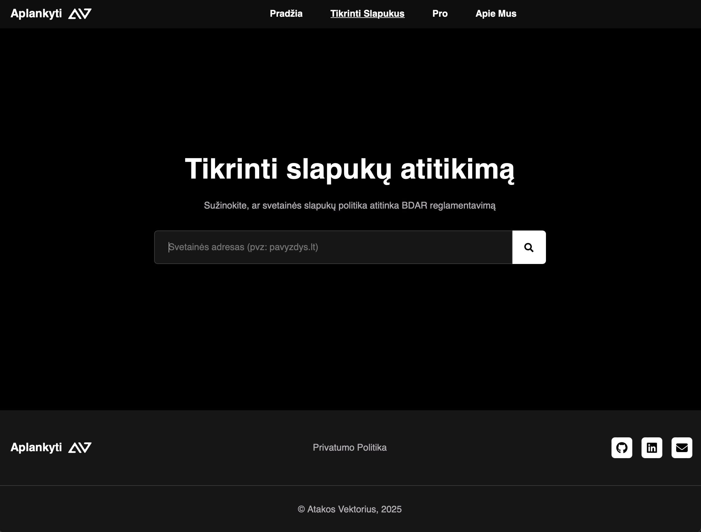

# Slapukai - BDAR Atitikimo Įrankis

[](https://nextjs.org/)
[](https://flask.palletsprojects.com/)
[](https://www.docker.com/)

**Slapukai** yra Atakos Vektoriaus sukurtas BDAR (Bendrojo duomenų apsaugos reglamento) slapukų atitikimo įrankis, skirtas padėti svetainėms atitikti Europos Sąjungos duomenų apsaugos reikalavimus.

</br>


## 🎯 Apie Projektą

Šis projektas suteikia galimybę svetainių savininkams lengvai pasitikrinti BDAR atitinktį slapukų atžvilgiu. Sistema leidžia vartotojams žinoti ar jų svetainės yra suderinamos su ES teisės aktais.

</br>




</br>


## 🛠 Technologijos

### Išvaizda
- **Next.js 13.5.6** - React framework su Server-Side Rendering
- **TypeScript** - Statinis tipų tikrinimas
- **Tailwind CSS** - Utility-first CSS framework
- **Material-UI (MUI)** - React komponentų biblioteka
- **Markdown/MDX** - Turinio valdymas

### Logika
- **Python** - Programavimo kalba
- **Flask** - Lengvas web framework
- **SQLite** - Duomenų bazė

### Infrastruktūra
- **Docker & Docker Compose** - Konteinerizacija
- **Caddy** - Apjungta naudojant atvirkštinį proxy serverį

</br>


## 📦 Diegimas

### 1. Klonuokite Repozitoriją

```bash
git clone https://github.com/atakosvektorius/cookie-web.git
cd cookie-web
```

### 2. Sukonfigūruokite Docker Compose

```bash
cp docker-compose.yml.sample docker-compose.yml
```

### 3. Redaguokite Docker Compose

```bash
nano docker-compose.yml
```


### 4. Paleiskite Docker Konteinerius

```bash
./runUpdateThisStack.sh
```

</br>


## 🚀 Naudojimas

Sistema bus pasiekiama adresu:
````
http://<serverio-ip>
````

</br>


## 🌍 Aplinkos Kintamieji

### Backend

```yaml
APP_DEBUG: true/false          # Debug režimas sistemos galinei daliai
API_KEY: [jūsų-api-raktas]     # API autentifikacijos raktas sistemos galinei daliai
```

</br>


## 📄 Licencija

Šis projektas yra autorinių teisių saugomas Atakos Vektoriaus. Prieš naudodami ar platindami, susisie

</br>


## 📞 Kontaktai

Dėl klausimų ar pagalbos, susisiekite su Atakos Vektoriaus komanda per mūsų oficialų tinklalapį:

https://atakosvektorius.lt
